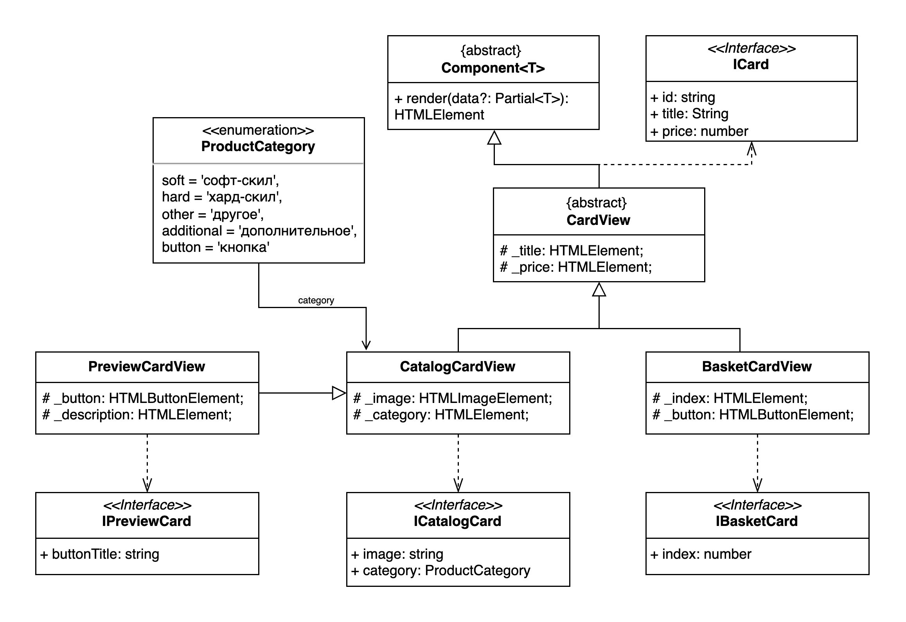

# Проектная работа "Веб-ларек"

Стек: HTML, SCSS, TS, Webpack

Структура проекта:
- src/ — исходные файлы проекта
- src/components/ — папка с JS компонентами
- src/components/base/ — папка с базовым кодом

Важные файлы:
- src/pages/index.html — HTML-файл главной страницы
- src/types/index.ts — файл с типами
- src/index.ts — точка входа приложения
- src/styles/styles.scss — корневой файл стилей
- src/utils/constants.ts — файл с константами
- src/utils/utils.ts — файл с утилитами

## Установка и запуск
Для установки и запуска проекта необходимо выполнить команды

```
npm install
npm run start
```

или

```
yarn
yarn start
```
## Сборка

```
npm run build
```

или

```
yarn build
```

## Базовый код
### 1. Абстрактный `Component`
Основным представлением является класс абстрактный `Component` с одной функцией `render` для отрисовки, принимающий аргументом обобщенный тип.
``` ts
render(data?: Partial<T>): HTMLElement {
	Object.assign(this as object, data ?? {});
	return this.container;
}
```

### 2. Class `Form`
Класс для универсального отображения форм. Наследуется от класса `Component`. Имеет состояния: 
- valid: boolean - отвечается за доступность кнопки submit;
- errors: string[] - отвечает за отображение ошибок валидации полей формы.

При изменении текста в полях, триггерит событие `${this.container.name}.${String(field)}:change` в `EventEmitter`

При изменении нажатии на кнопку submit, триггерит событие `${this.container.name}:submit` в `EventEmitter`

### 3. Class `Modal`
Класс для отображения модального онка. Содержит в себе котейнер для отображения конкретного компонента.

Функция `open()` открывает модульное окно, триггерит событие `modal:open`. 

Функция `close()` закрывает окно, триггерит событие `modal:close`.

Для взаимодействия с классом используется обертка `ModalRouter`, хранит в себе ссылку на экземпляр `Modal`.

``` ts
interface IModalRouter {
	route<T>(to: Component<T>, data?: Partial<T>): void;
}
```

## Networking
Для сетевого взаимодействия с сервером используется класс `LarekAPI`, имплементирующий интерфейс `ILarekAPI`.

``` ts
interface ILarekAPI {
	getProductList(): Promise<IProduct[]>;              // [GET] запрос, возвращает массив продуктов
	getProductItem(id: string): Promise<IProduct>;      // [GET] запрос, возвращает конкретную карточку по ее `id`
	order(order: IOrderForm): Promise<IOrderResult>;    // [POST] запрос, в теле запроса принимает всю инофрмацию из `IOrderModel`, общую стоимость товаров, массив идентификаторов товаров. В случае успешного заказа, возвращает обсщую стоимость и уникальный идентификатор заказа.
}
```

## Компоненты модели данных (бизнес-логика)
### 1. Class `BasketModel`
Имплементирует интерфейс `IBasketModel`. Реализует добавление, удаление, хранение товаров, выбранных для покупки.

При изменении значения `items` триггерится событие `basket:change` в `EventEmitter`.

Метод `reset()` вызывается после успешной оплаты и сбрасывает значение `items`.

``` ts
interface IBasketModel {
    items: IProduct[];              // хранит выбранные товары для покупки;
	totalPrice: number;             // вычисляет общую стоимость выбранных товаров;
	add(product: IProduct): void;   // добавляет продукт в корзину;
	remove(id: string): void;       // удаляет продукт их корзины по `id` продукта;
	contains(id: string): boolean;  // проверяет наличие продукта в корзине по его `id`;
	reset(): void;                  // очищает корзину.
}
```

### 2. Class `CatalogModel`
Имплементирует интерфейс `ICatalogModel`. Реализует хранение, чтение товаров для отображения в `PageView`.

При изменении значения `items` триггерится событие `catalog:change` в `EventEmitter`.

``` ts
interface ICatalogModel {
	items: IProduct[];                          // хранит товары для отображения в каталоге;
	setItems(items: IProduct[]): void;          // устанавливает товары для отображения;
	getItem(id: string): IProduct | undefined;  // возвращает товар по `id`, если такой имеется.
}
```

### 3. Class `OrderModel`
Имплементирует интерфейс `IOrderModel`. Хранит личные данные пользователя, требуемые для заказа.

При изменении значений `payment`, `address` триггерится событие `order:payment-change` в `EventEmitter`.

Метод `reset()` вызывается после успешной оплаты и сбрасывает значения всех переменных.

``` ts
interface IOrderModel {
	payment: PaymentType;   // хранит даные о способе оплаты;
	address: string;        // хранит адрес;
	email: string;          // хранит почту;
	phone: string;          // хранит номер телефона.
	reset(): void;          // очищает данные.
}
```

### 4. Валидация данных
Для валидации данных используется класс `Validator`, реализующий интерфейс `IValidator`:

``` ts
interface IValidator {
	validate(value: object): { valid: boolean; errors: string[] };
}
```

Сама валидация происходит в `OrderValidatorRule`, `UserDataValidatiorRule`. Класс `Validator` хранит ссылку на экзепляр класса, реализующего интерфейс `IValidatorRule`:

``` ts
interface IValidatorRule<T> {
	validate(value: T): { valid: boolean; errors: string[] };
}
```

Пример с использованием паттерна Builder:

``` ts 
const validator = new Validator();
const orderResult = validator
				.setValidator(new OrderValidatorRule())
				.validate(orderModel);

const userDataResult = validator
			.setValidator(new UserDataValidatiorRule())
			.validate(orderModel);
```

Класс `OrderValidatorRule` проверяет выбранный способ оплаты, минимальное количество символов в адресе - 5;

Класс `UserDataValidatiorRule` проверяет валидность почты и номер телефона с помощью регулярных выражений:

- email: `/^[^\.\s][\w\-\.{2,}]+@([\w-]+\.)+[\w-]{2,}$/gm`
- phone: `/^(\+7|7|8)?[\s\-]?\(?[489][0-9]{2}\)?[\s\-]?[0-9]{3}[\s\-]?[0-9]{2}[\s\-]?[0-9]{2}$/gm`

В случае неуспешной валидации, возвращается массив ошибок.

### 5. `index.ts`

Основная логика реализации взаимодействия между классами реализована в `index.js`.

Хранит ссылки на экземпляры:

**Модели:** `CatalogModel`, `OrderModel`, `BasketModel`;

**Сеть:** `LarekAPI`;

**Валидация:** `Validator`;

**Роутер модалького окна**: `ModalRouter`;

**Представления:** `PageView`, `BasketView`, `PaymentInfoFormView`, `UserDataFormView`.

Взаимодействие между модулями реализовано 2 способами:
1. С помощью паттерна Наблюдатель и класс `EventEmitter`;
2. С помощью прокидывания функций и index.js до конечного модуля

Обработка событий:
- `catalog:change` - `pageView` рендерит карточки из `catalogModel`;
- `item:click` - по `id` находим карточку в `catalogModel`, создаем экземпляр класса `PreviewCardView`, передаем его в `modalRouter`
- `basket:open` - в `modalRouter` передаем `basketView`
- `basket:changed` - рендер корзины, рендер каунтера корзины
- `order:payment-change` - валидация `paymentInfoFormView`
- `order.address:change` - сохранение адреса в `orderModel`
- `order:submit` - валидация сохраненных телефона и почты, в `modalRouter` передаем `userDataFormView`
- `/^contacts\..*:change/` - сохраняем телефон, почту, валидируем значения
- `contacts:submit` - оформляем заказ на сервере, при успешном ответе сбрасываем корзину в `basketModel`, очищаем все данные`orderlModel`, открываем экран успеного заказа.
- `modal:open` - запрещаем скролл
- `modal:close` - разрешаем скролл

## Компоненты представления

### 1. Компоненты карточек

Для реализации карточек товаров был выбран абстрактный класс `CardView`, наследумый от класса `Component`.

- `BasketCardView extends CardView` - карточка товара в корзине
- `CatalogCardView extends CardView` - карточка товара в каталоге
- `PreviewCardView extends CatalogCardView` - карточка товара в модальном окне. наследуется от `CatalogCardView` с целью переиспользования свойств изображения и категори.




### 2. Class `PageView`

Класс хранит в себе ссылки на экземпляры: 

 - `_counter` - указывается количество товаров в корзине;
 - `_wrapper` - блокируется скролл при открытии модального окна;
 - `_basket` - обрабатывается нажатие на корзину.
 - `_catalog` - отображает массив каточек

Имплементирует интерфейс `IPage`:

``` ts
interface IPage {
	counter: number; 				// количество товаров в корзине;
	locked: boolean; 				// блокирует скролл.
	catalog: HTMLElement[]; // карточки
}
```

### 3. Class `BasketView`

Класс, наследуемый от `Component`. Хранит ссылки на:

- _list: HTMLUListElement - список карточек `BasketCardView`;
- _total: HTMLElement - общая стоимость товаров;
- _button: HTMLButtonElement - кнопка для оформления заказа.

В конструктом принимает аргументом:

``` ts
interface IBasketActions {
	purchase: () => void;
}
```

При нажатии на кнопку `_button` - вызывается метод `purchase`.

### 4. Модальные окна

> `PaymentInfoFormView` наслеуется от `Form`. Хранит ссылки на:

- _paymentTypeCardButton - кнопка выбор способа оплаты картой онлайн;
- _paymentTypeCashButton - кнопка выбор способа оплаты наличкой;
- _addressInput - инпут адреса.

В конструктор аргументом принимает:

``` ts
type IPaymentInfoViewActions = {
	paymentClick?: (type: PaymentType) => void;
};
```
При нажатии на кнопоки, вызывает метод `paymentClick`, передавая в него `PaymentType.Card` или `PaymentType.Cash`.

При рендере принимает значение `payment`, активной кнопке выставляет класс `button_alt-active`, у неактивной удаляет.

При открытии формы, рендерятся данные из класса `OrderModel`

> `UserDataFormView` наслеуется от `Form`. Хранит ссылки на:

- _emailInput: HTMLInputElement - инпут почты
- _phoneInput: HTMLInputElement - инпут номера телефона

> `SuccessView` наслеуется от `Form`. Хранит ссылки на:

- _button: - кнопка закрытия;
- _description: - отображает общую сумму заказа, полученную в респосе `/order`

Изменения в полях формы отслеживаются за счет базового функционала класса `Form`.

## Ключевые типы данных

``` ts
// Объект продукта
interface IProduct {
	id: string;                 // идентификатор
	description: string;        // подробное описание
	image: string;              // относительный путь на изображение
	title: string;              // название
	category: ProductCategory;  // категория товара
	price: number;              // цена
}

// Категория товара
enum ProductCategory {
	soft = 'софт-скил',
	hard = 'хард-скил',
	other = 'другое',
	additional = 'дополнительное',
	button = 'кнопка',
}

// Тип платежа
enum PaymentType {
	Card = 'online',  // картой
	Cash = 'offline', // при получении
}

// Информацию по заказу. Разделено на 3 разных интерфейса для разбивки по разным формам.
type IOrderForm = IOrderPaymentInfo & IOrderUserData & IOrederProducts;

interface IOrderPaymentInfo {
	payment: PaymentType;   // способ платежа
	address: string;        // адрес
}

interface IOrderUserData {
	email: string;  // почта
	phone: string;  // номер телефона
}

interface IOrederProducts {
	total: number;      // общая стоимость
	items: string[];    // массив идентификаторов товаров
}

// Успешный результат выполнения заказа
interface IOrderResult {
	id: string;
	total: number;
}
```